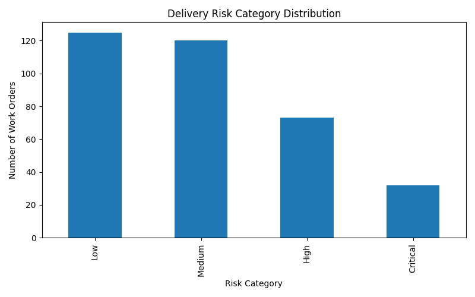
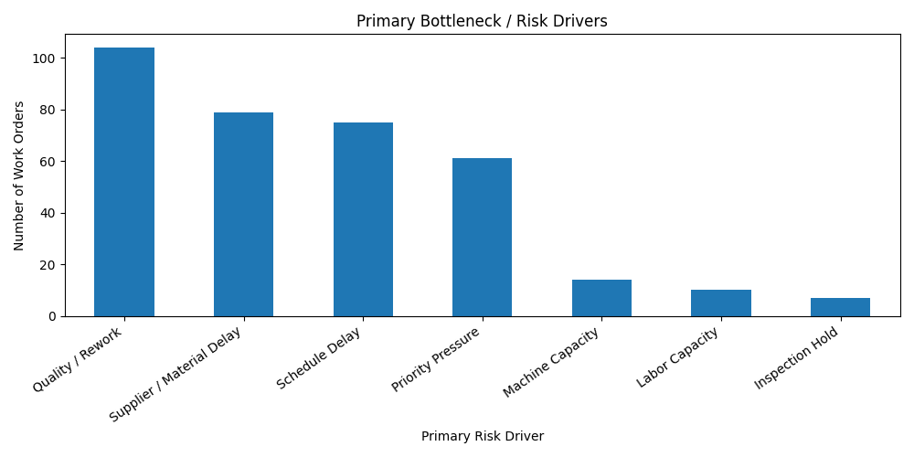
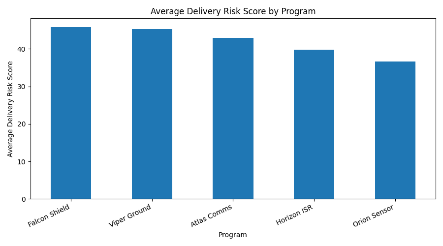
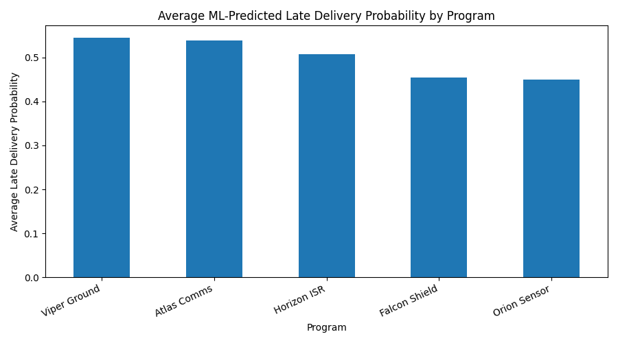

# Defense Production Readiness Agent

An AI-assisted production readiness analytics project that simulates defense hardware work orders, scores delivery risk, predicts late-delivery probability, identifies operational bottlenecks, and generates structured recommendations through an interactive Streamlit dashboard.

---

## Project Disclaimer

This project uses fully synthetic data and is intended only for educational and demonstration purposes. It does not use classified, export-controlled, proprietary, operational, or real defense manufacturing data. 

The analysis, model outputs, and recommendations generated by this project are simulated and should not be used for real-world production, engineering, quality, safety, or defense decision-making.

---

## Project Overview

Defense manufacturing programs often depend on timely coordination across production cells, material availability, supplier performance, inspection status, rework capacity, labor availability, machine readiness, and delivery deadlines. This project models that environment using fully synthetic production data and creates a decision-support workflow that helps identify which work orders are most at risk and why. Furthermore, this project combines synthetic data generation, rule-based production risk scoring, machine learning late-delivery prediction, agent-style operational recommendations, visual analytics, and an interactive dashboard.

---

## Key Features

- Generates synthetic defense production work order data.
- Scores delivery readiness risk based on schedule delay, supplier delay, material availability, quality holds, inspection holds, rework hours, machine availability, labor capacity, and priority level.
- Classifies work orders into Low, Medium, High, and Critical risk categories.
- Trains a machine learning model to predict whether a work order is likely to finish late.
- Adds late-delivery probability and predicted late-delivery status to each work order.
- Identifies top bottleneck drivers across programs and production cells.
- Produces an agent-style production readiness brief.
- Creates a machine learning model report with accuracy, baseline late-delivery rate, and confusion matrix.
- Provides a Streamlit dashboard for executive summary, risk analysis, ML late-delivery prediction, bottlenecks, recommendations, and data exploration.

---

## Machine Learning Late-Delivery Prediction

This project includes a Random Forest classification model that predicts whether each synthetic production work order is likely to finish later than its planned completion date.

The model uses operational features such as program, part category, production cell, priority level, material availability, supplier delay days, inspection holds, quality holds, rework hours, defect count, machine availability, labor capacity, and estimated cost impact.

The machine learning workflow generates three additional fields:

```text
late_delivery_flag
late_delivery_probability
late_delivery_prediction
```

`late_delivery_flag` represents whether the synthetic work order actually finished later than its planned completion date.

`late_delivery_probability` represents the model's estimated probability that the work order will finish late.

`late_delivery_prediction` represents the model's binary prediction, where `1` indicates predicted late and `0` indicates predicted on time.

The trained model is saved as:

```text
outputs/models/late_delivery_model.joblib
```

The model performance summary is saved as:

```text
outputs/reports/late_delivery_model_report.md
```

---

## Agentic Workflow

This project uses a structured agent-style workflow rather than a simple static report. Each agent analyzes the production data from a specific operational perspective and contributes to the final readiness brief.

The **Production Readiness Agent** reviews open work orders, identifies delivery risk, and prioritizes high-risk items.

The **Material Risk Agent** evaluates material shortages and supplier delays that could affect production schedules.

The **Quality Hold Agent** reviews inspection holds, quality holds, and rework burden.

The **Program Briefing Agent** creates a concise operational summary intended for program, manufacturing, or operations stakeholders.

The agent workflow is designed as an analyst-support demonstration. It helps organize risk signals, summarize operational issues, and generate structured recommendations for review by manufacturing, quality, engineering, or program management stakeholders.

---

## How to Run the Project

Install the required packages.

```powershell
python -m pip install -r requirements.txt
```

Generate the dataset, scored output, ML model, model report, figures, and readiness brief.

```powershell
python src/main.py
```

Launch the Streamlit dashboard.

```powershell
streamlit run src/dashboard.py
```

---

## Optional Virtual Environment Setup

A virtual environment is recommended but not required.

```powershell
python -m venv venv
.\venv\Scripts\activate
python -m pip install -r requirements.txt
```
---

## Dashboard Charts and Generated Visualizations

The Streamlit dashboard displays five interactive charts across the Risk Overview, ML Late-Delivery Prediction, and Bottleneck Analysis sections. These charts help users explore delivery risk, program-level readiness, late-delivery probability, bottleneck drivers, and production cell risk.

Four of these visualizations are also saved as PNG files in the `outputs/figures/` folder when `python src/main.py` is run. The **Average Risk by Production Cell** chart is generated directly inside the Streamlit app and is not saved as a PNG output file.

The dashboard also includes an additional interactive chart, **Average Risk by Production Cell**. This chart compares the average delivery risk score across each simulated production cell. It helps show whether certain cells may be experiencing higher operational pressure from schedule delays, material constraints, rework, machine availability, labor capacity, or quality-related holds. This view is useful for identifying where production managers may need to rebalance workload, review staffing, or investigate recurring bottlenecks.

---

### Risk Category Distribution



This saved visualization shows how many work orders fall into each delivery risk category: Low, Medium, High, and Critical.

The risk categories are based on the rule-based delivery readiness score, which considers schedule delay, supplier delay, material availability, inspection holds, quality holds, rework hours, machine availability, labor capacity, and priority level.

This helps summarize the overall production risk profile at a glance.

---

### Primary Bottleneck Drivers



This saved visualization shows the most common primary risk drivers across all scored work orders.

Each work order is assigned a primary risk driver based on the factor contributing most heavily to its delivery risk score. Examples include supplier/material delay, quality/rework burden, schedule delay, inspection hold, machine capacity, labor capacity, and priority pressure.

This helps identify which operational constraints are appearing most often across the simulated production environment.

---

### Average Delivery Risk by Program



This saved visualization compares the average delivery risk score across each simulated defense program.

Instead of reviewing work orders one by one, this provides a program-level view of production readiness. Programs with higher average risk scores may have greater exposure to schedule delays, supplier issues, quality holds, labor constraints, or machine availability problems.

---

### ML-Predicted Late Delivery Probability by Program



This saved visualization shows the average machine learning-predicted late-delivery probability for each simulated defense program.

The values come from the Random Forest classification model. A higher average probability means that the program has more work orders with characteristics associated with late delivery.

This complements the rule-based delivery risk score by adding a predictive modeling layer.

---

## File Breakdown

`src/main.py` runs the full project workflow. It generates the synthetic production work order dataset, applies delivery risk scoring, trains the late-delivery prediction model, saves project outputs, creates visualizations, and generates the production readiness brief.

`src/data_generator.py` creates the synthetic defense production work order dataset. The generated data includes simulated programs, production cells, part categories, schedule delays, supplier delays, material availability, inspection holds, quality holds, rework hours, defect counts, machine availability, labor capacity, and estimated cost impact.

`src/risk_scoring.py` applies the rule-based delivery readiness scoring logic. It calculates a delivery risk score for each work order, assigns a Low, Medium, High, or Critical risk category, and identifies the primary risk driver contributing to each work order’s score.

`src/ml_model.py` trains the machine learning late-delivery prediction model. It creates the late-delivery target, preprocesses categorical and numeric features, trains a Random Forest classifier, adds late-delivery probabilities and predictions to the dataset, saves the trained model, and creates a markdown model report.

`src/agents.py` contains the agent-style recommendation workflow. The Production Readiness Agent, Material Risk Agent, Quality Hold Agent, and Program Briefing Agent each analyze the scored production data from a different operational perspective and contribute to the final readiness brief.

`src/visualization.py` creates the saved PNG visualizations in the `outputs/figures/` folder. These visuals summarize risk category distribution, bottleneck drivers, program-level delivery risk, and ML-predicted late-delivery probability by program.

`src/dashboard.py` powers the Streamlit dashboard. It provides interactive filters, executive metrics, production risk summaries, ML late-delivery prediction views, bottleneck analysis, agent-generated recommendations, and a data explorer.

`outputs/reports/scored_work_orders.csv` is generated by the project and contains the final scored dataset, including delivery risk score, risk category, primary risk driver, late-delivery flag, late-delivery probability, and late-delivery prediction.

`outputs/reports/production_readiness_brief.md` is generated by the agent workflow and contains a structured production readiness summary with operational recommendations.

`outputs/reports/late_delivery_model_report.md` is generated by the machine learning workflow and summarizes model objective, training/testing rows, baseline late-delivery rate, accuracy, and confusion matrix.

`outputs/models/late_delivery_model.joblib` is the saved trained Random Forest model generated by the project.

`outputs/figures/` contains the generated PNG visualizations used for reporting.

---

## Project Structure

```text
defense-production-readiness-agent/
│
├── data/
│   └── defense_production_work_orders.csv              # Generated by src/main.py
│
├── outputs/
│   ├── reports/
│   │   ├── late_delivery_model_report.md               # Generated by src/main.py
│   │   ├── production_readiness_brief.md               # Generated by src/main.py
│   │   └── scored_work_orders.csv                      # Generated by src/main.py
│   │
│   ├── models/
│   │   └── late_delivery_model.joblib                  # Generated by src/main.py
│   │
│   └── figures/
│       ├── risk_distribution.png                       # Generated by src/visualization.py via src/main.py
│       ├── bottleneck_drivers.png                      # Generated by src/visualization.py via src/main.py
│       ├── program_risk_summary.png                    # Generated by src/visualization.py via src/main.py
│       └── late_delivery_probability_by_program.png    # Generated by src/visualization.py via src/main.py
│
├── src/
│   ├── agents.py                                      # Agent-style recommendation workflow
│   ├── dashboard.py                                   # Streamlit dashboard
│   ├── data_generator.py                              # Synthetic data generator
│   ├── main.py                                        # Main project runner
│   ├── ml_model.py                                    # Late-delivery ML model
│   ├── risk_scoring.py                                # Rule-based risk scoring
│   └── visualization.py                               # PNG visualization generator
│
├── requirements.txt                                   # Dependency list
└── README.md                                          # Project documentation


